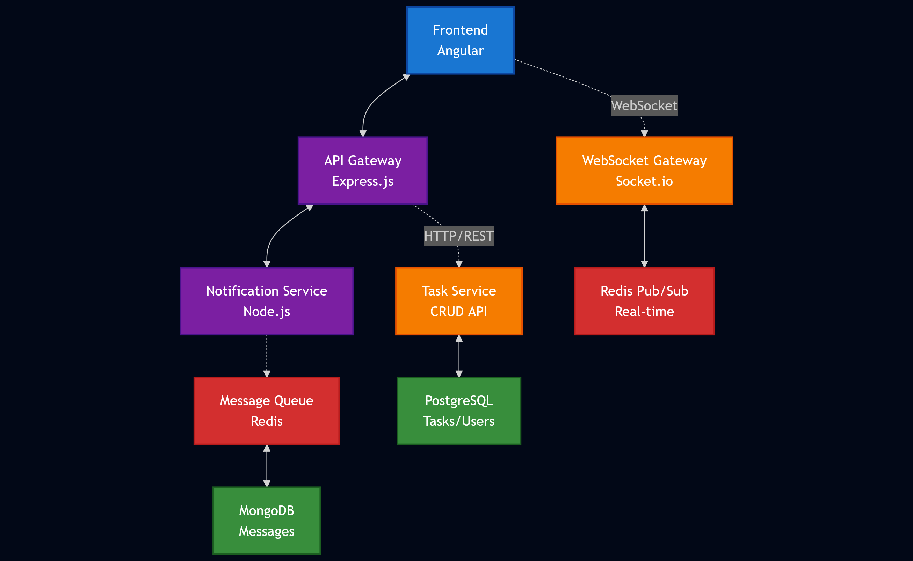
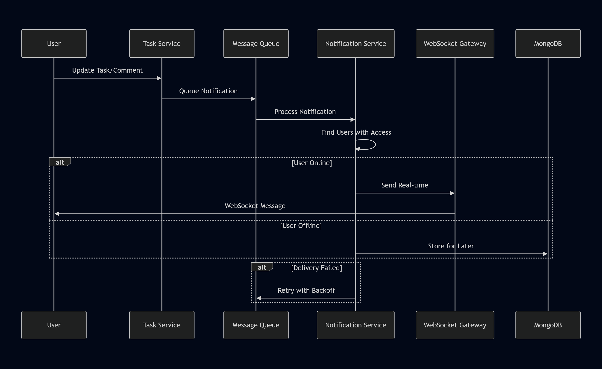

# Part 3 – Technical Design: Real-time Notification System

## Scenario
"We want to add a real-time notification system (Slack-like) to inform users when a task is updated or commented."

## 1. Architecture Overview



## 2. Technology Stack

### Core Technologies
- **WebSocket**: Socket.io for real-time bidirectional communication
- **Message Queue**: Redis for pub/sub and job queuing
- **Database**: 
  - PostgreSQL for structured data (users, tasks, permissions)
  - MongoDB for message storage (flexible schema, high write volume)
- **Cache**: Redis for session management and temporary data

### Supporting Technologies
- **Authentication**: JWT tokens with refresh mechanism
- **Load Balancing**: Redis adapter for Socket.io clustering
- **Monitoring**: Prometheus + Grafana for metrics

## 3. Security Implementation

### Authentication & Authorization
```javascript
// JWT-based WebSocket authentication
io.use(async (socket, next) => {
  const token = socket.handshake.auth.token;
  const user = await verifyJWT(token);
  socket.userId = user.id;
  socket.userRoles = user.roles;
  next();
});
```

### Visibility Rules
- **Room-based Access**: Users join rooms based on task/project permissions
- **Permission Matrix**: Check user permissions before message delivery
- **Data Filtering**: Filter message content based on user access level

### Security Measures
- **Rate Limiting**: Prevent spam and DoS attacks
- **Input Sanitization**: Validate all incoming messages
- **CORS Configuration**: Restrict WebSocket origins
- **SSL/TLS**: Encrypt all communications

## 4. Message Storage Strategy

### Message Schema (MongoDB)
```javascript
{
  _id: ObjectId,
  taskId: String,
  userId: String,
  type: 'task_update' | 'comment' | 'status_change',
  content: String,
  metadata: {
    oldValue: String,
    newValue: String,
    field: String
  },
  timestamp: Date,
  deliveryStatus: {
    sent: [userId],
    delivered: [userId],
    read: [userId]
  }
}
```

### Storage Optimization
- **TTL Indexes**: Auto-delete old messages (90 days)
- **Sharding**: Distribute by taskId for horizontal scaling
- **Compression**: Use MongoDB compression for storage efficiency

## 5. Delivery & Retry Mechanism

### Delivery Flow



1. **Event Trigger**: Task update/comment creates notification
2. **Queue Processing**: Redis Bull queue processes notification
3. **User Lookup**: Find users with task access
4. **Real-time Delivery**: Send via WebSocket if online
5. **Offline Storage**: Store for offline users
6. **Retry Logic**: Exponential backoff for failed deliveries

### Implementation
```javascript
// Notification processing
const notificationQueue = new Bull('notifications', {
  redis: redisConfig,
  defaultJobOptions: {
    attempts: 3,
    backoff: 'exponential',
    delay: 2000
  }
});

notificationQueue.process(async (job) => {
  const { taskId, message, userIds } = job.data;
  
  for (const userId of userIds) {
    if (isUserOnline(userId)) {
      await sendRealTimeNotification(userId, message);
    } else {
      await storeOfflineNotification(userId, message);
    }
  }
});
```

### Retry Strategy
- **Immediate Retry**: For temporary network issues
- **Exponential Backoff**: 2s, 4s, 8s intervals
- **Dead Letter Queue**: Failed messages after max attempts
- **Manual Recovery**: Admin interface for failed notifications

## 6. Scalability Considerations

### Horizontal Scaling
- **Socket.io Clustering**: Redis adapter for multi-instance support
- **Database Sharding**: Distribute load across multiple databases
- **Load Balancing**: Sticky sessions for WebSocket connections

### Performance Optimization
- **Connection Pooling**: Efficient database connections
- **Message Batching**: Group notifications for bulk delivery
- **Caching**: Redis for frequently accessed data
- **CDN**: Static assets delivery optimization

## 7. Monitoring & Observability

### Key Metrics
- **Connection Count**: Active WebSocket connections
- **Message Throughput**: Messages per second
- **Delivery Success Rate**: Percentage of successful deliveries
- **Queue Depth**: Pending notifications in queue
- **Response Time**: End-to-end notification latency

### Alerting
- **High Queue Depth**: Alert when queue exceeds threshold
- **Connection Drops**: Monitor WebSocket disconnections
- **Failed Deliveries**: Alert on high failure rates
- **Resource Usage**: CPU, memory, and database metrics